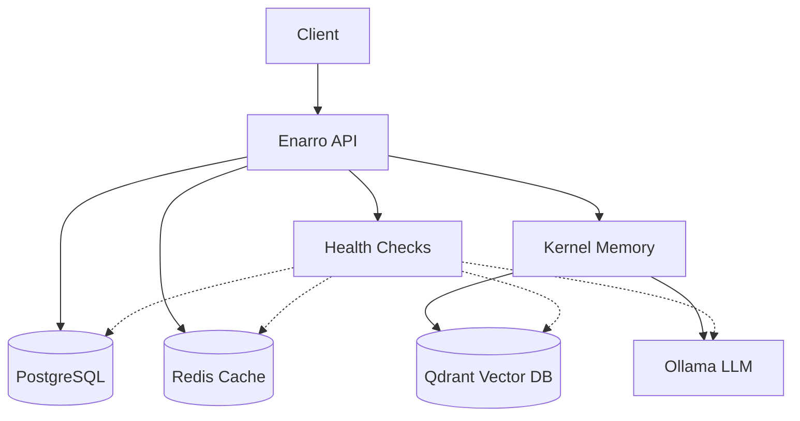

# Enarro - Production-Grade RAG Application

[](https://dotnet.microsoft.com/)
[](LICENSE)
[](https://learn.microsoft.com/en-us/dotnet/aspire/)

A production-ready Retrieval-Augmented Generation (RAG) application built with .NET 10, featuring advanced document processing, streaming chat responses, and comprehensive infrastructure orchestration using .NET Aspire.

## 🚀 Features

### Core Capabilities
- **📄 Multi-Document Processing** - Batch upload and processing with parallel execution
- **💬 Context-Aware Chat** - Conversation history with session management
- **🔄 Streaming Responses** - Real-time chat responses using Server-Sent Events (SSE)
- **📚 Document Management** - Full CRUD operations with metadata persistence
- **🔍 Semantic Search** - Vector-based document retrieval with relevance scoring
- **📊 Source Citations** - Automatic citation extraction with relevance tracking

### Production Features
- **🗄️ PostgreSQL Integration** - Persistent document metadata with EF Core
- **⚡ Redis Distributed Caching** - Session management for horizontal scaling
- **📝 Structured Logging** - Serilog with console and file outputs
- **🏥 Health Checks** - Comprehensive monitoring for all dependencies
- **🐳 Container Orchestration** - Full .NET Aspire infrastructure management

## 🏗️ Architecture

### Technology Stack

| Component | Technology |
|-----------|-----------|
| **RAG Orchestration** | Microsoft Kernel Memory |
| **LLM & Embeddings** | Ollama (phi3, nomic-embed-text) |
| **Vector Database** | Qdrant |
| **Relational Database** | PostgreSQL |
| **Distributed Cache** | Redis |
| **Service Orchestration** | .NET Aspire |
| **API Framework** | ASP.NET Core 10.0 |
| **Logging** | Serilog |

### System Architecture



## 📋 Prerequisites

- [.NET 10 SDK](https://dotnet.microsoft.com/download/dotnet/10.0)
- [Docker Desktop](https://www.docker.com/products/docker-desktop)
- [Ollama](https://ollama.ai/) (for local LLM)

## 🚀 Quick Start

### 1. Clone the Repository

```bash
git clone https://github.com/yourusername/enarro.git
cd enarro
```

### 2. Pull Required Ollama Models

```bash
ollama pull phi3
ollama pull nomic-embed-text
```

### 3. Run with .NET Aspire

```bash
dotnet run --project Enarro.AppHost
```

This single command will:
- Start PostgreSQL container
- Start Redis container
- Start Qdrant container
- Start Ollama container
- Run database migrations
- Launch the API
- Open the Aspire dashboard

### 4. Access the Application

- **API**: https://localhost:7001
- **Swagger UI**: https://localhost:7001/swagger
- **Aspire Dashboard**: https://localhost:15888
- **Health Checks**: https://localhost:7001/health

## 📖 API Documentation

### Document Management

#### Upload Single Document
```http
POST /api/v1/ingest
Content-Type: multipart/form-data

file: <file>
tags: {"category": "technical", "department": "engineering"}
```

#### Upload Multiple Documents
```http
POST /api/v1/ingest/batch
Content-Type: multipart/form-data

files: <file1>, <file2>, <file3>
```

#### List Documents
```http
GET /api/v1/documents?page=1&pageSize=20&tag=technical
```

#### Get Document Details
```http
GET /api/v1/documents/{id}
```

#### Delete Document
```http
DELETE /api/v1/documents/{id}
```

### Chat Operations

#### Standard Chat
```http
POST /api/v1/chat
Content-Type: application/json

{
  "message": "What is machine learning?",
  "sessionId": "optional-session-id",
  "userId": "optional-user-id",
  "minRelevance": 0.3,
  "filters": {
    "category": "technical"
  }
}
```

#### Streaming Chat
```http
POST /api/v1/chat/stream
Content-Type: application/json

{
  "message": "Explain neural networks",
  "sessionId": "session-123"
}
```

Response format (Server-Sent Events):
```
data: Neural
data:  networks
data:  are...
data: [DONE]
```

## 🔧 Configuration

### appsettings.json

```json
{
  "RAGConfigs": {
    "IndexName": "rag-test",
    "ChatModel": "phi3",
    "EmbeddingModel": "nomic-embed-text",
    "Retrieval": {
      "MinRelevance": 0.3,
      "MaxResults": 5,
      "AnswerTokens": 4096
    },
    "Conversation": {
      "MaxHistoryMessages": 10,
      "SessionTimeoutMinutes": 60
    },
    "DocumentProcessing": {
      "MaxConcurrentUploads": 5,
      "MaxFileSizeMB": 50,
      "AllowedExtensions": [".pdf", ".docx", ".txt", ".md", ".xlsx", ".pptx", ".json"]
    }
  }
}
```

## 🗄️ Database Schema

### Documents Table
```sql
CREATE TABLE documents (
    id UUID PRIMARY KEY,
    file_name VARCHAR(500) NOT NULL,
    content_type VARCHAR(100) NOT NULL,
    size_bytes BIGINT NOT NULL,
    uploaded_at TIMESTAMP NOT NULL,
    uploaded_by VARCHAR(100),
    status VARCHAR(50) NOT NULL,
    chunk_count INTEGER DEFAULT 0,
    error_message TEXT,
    created_at TIMESTAMP DEFAULT CURRENT_TIMESTAMP,
    updated_at TIMESTAMP DEFAULT CURRENT_TIMESTAMP
);
```

### Document Tags Table
```sql
CREATE TABLE document_tags (
    id SERIAL PRIMARY KEY,
    document_id UUID REFERENCES documents(id) ON DELETE CASCADE,
    tag_key VARCHAR(100) NOT NULL,
    tag_value VARCHAR(500) NOT NULL,
    created_at TIMESTAMP DEFAULT CURRENT_TIMESTAMP
);
```

## 🏥 Health Monitoring

Access the health endpoint to check all service statuses:

```http
GET /health
```

Response:
```json
{
  "status": "Healthy",
  "timestamp": "2026-02-07T06:00:00Z",
  "checks": [
    {
      "name": "postgresql",
      "status": "Healthy",
      "duration": 12.5,
      "tags": ["db", "sql"]
    },
    {
      "name": "redis",
      "status": "Healthy",
      "duration": 8.3,
      "tags": ["cache"]
    },
    {
      "name": "ollama",
      "status": "Healthy",
      "duration": 45.2,
      "tags": ["llm"]
    },
    {
      "name": "qdrant",
      "status": "Healthy",
      "duration": 15.7,
      "tags": ["vector-db"]
    }
  ],
  "totalDuration": 81.7
}
```

## 📊 Logging

Logs are written to:
- **Console**: Colored output with timestamps
- **Files**: `logs/enarro-[date].log` (30-day retention)

Log levels can be configured per namespace in `appsettings.json`:

```json
{
  "Serilog": {
    "MinimumLevel": {
      "Default": "Information",
      "Override": {
        "Microsoft.AspNetCore": "Warning",
        "Microsoft.EntityFrameworkCore": "Warning",
        "Enarro": "Debug"
      }
    }
  }
}
```

## 🧪 Development

### Running Migrations

```bash
cd Enarro
dotnet ef migrations add MigrationName
dotnet ef database update
```

### Building the Project

```bash
dotnet build
```

### Running Tests

```bash
dotnet test
```

## 🐳 Docker Deployment

The application uses .NET Aspire for container orchestration. All containers are managed automatically:

- **PostgreSQL**: Port 5432 (persistent volume)
- **Redis**: Port 6379 (persistent volume)
- **Qdrant**: Port 6333 (HTTP), 6334 (gRPC) (persistent volume)
- **Ollama**: Port 11434 (persistent volume)

## 📈 Performance

- **Concurrent Uploads**: Up to 5 simultaneous document uploads
- **Session Timeout**: 60 minutes (sliding), 24 hours (absolute)
- **Max File Size**: 50 MB
- **Chunk Size**: 512 tokens with 50-token overlap
- **Max History**: 10 messages per session

## 🛣️ Roadmap

### Phase 4: Enterprise Features (Planned)
- [ ] JWT Authentication & Authorization
- [ ] User Management System
- [ ] API Rate Limiting
- [ ] Advanced Query Rewriting
- [ ] Document Versioning
- [ ] Multi-tenancy Support

### Phase 5: Optimization & Scaling (Planned)
- [ ] Hybrid Search (Semantic + Keyword)
- [ ] Re-ranking Pipeline
- [ ] Caching Strategies
- [ ] Performance Optimization
- [ ] Load Testing

## 🤝 Contributing

Contributions are welcome! Please feel free to submit a Pull Request.

1. Fork the repository
2. Create your feature branch (`git checkout -b feature/AmazingFeature`)
3. Commit your changes (`git commit -m 'Add some AmazingFeature'`)
4. Push to the branch (`git push origin feature/AmazingFeature`)
5. Open a Pull Request

## 📄 License

This project is licensed under the MIT License - see the [LICENSE](LICENSE) file for details.

## 🙏 Acknowledgments

- [Microsoft Kernel Memory](https://github.com/microsoft/kernel-memory)
- [Ollama](https://ollama.ai/)
- [Qdrant](https://qdrant.tech/)
- [.NET Aspire](https://learn.microsoft.com/en-us/dotnet/aspire/)

## 📧 Contact

For questions or support, please open an issue on GitHub.

---

**Built with ❤️ using .NET 10 and .NET Aspire**
